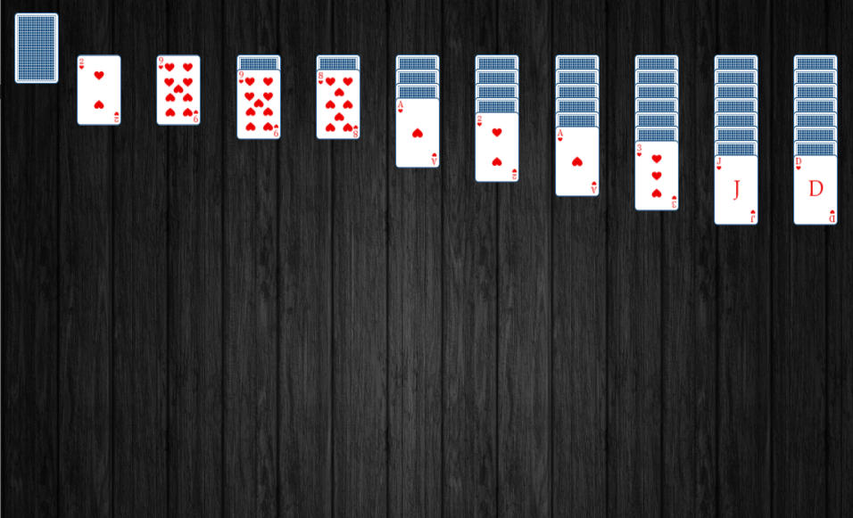

# Spider Solitaire

> This is a JavaScript card game made by me with :heart:

## General info

This card game was made to expand my knowledge. The main idea behind this project is to open it on all devices, every computer and phone to enjoy the game anywhere!

## Screenshots

## Technologies

-   JavaScript ES6
-   CSS3
-   HTML5

## Setup

-   `git clone https://github.com/DamianJudek/Spider-Solitaire.git` to clone this repository
-   run index.html - enjoy the game!

## Features

-   Drag & Drop
-   Responsivity
-   undoing movements ( ctrl + z)
-   Animations

### To Do

-   implementation of two-color support

## Status

The project is now finished, but it is quite possible that I will come back to it.

## Inspiration

My inspiration was the Windows 7 Spider Solitaire
